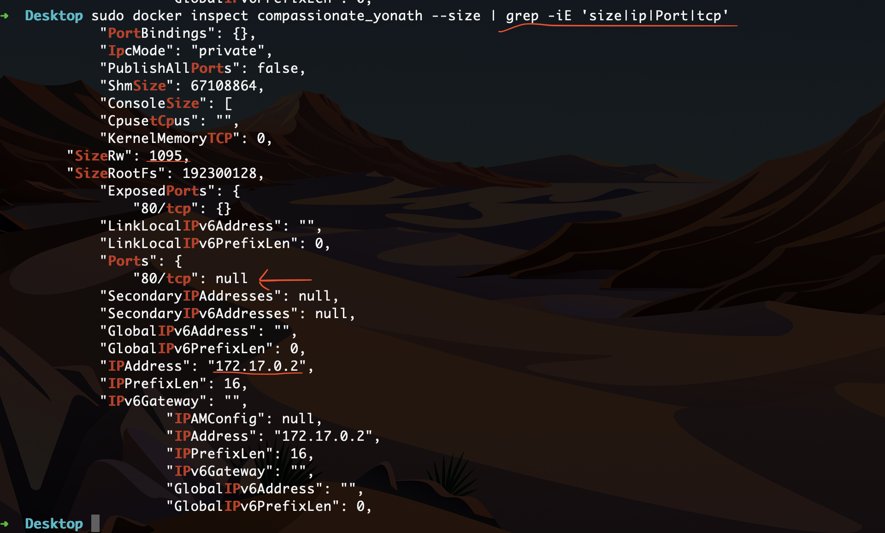
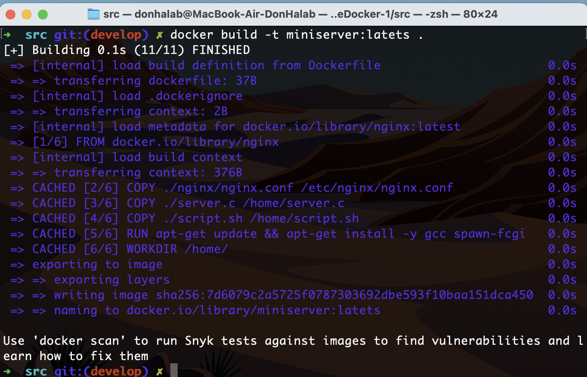
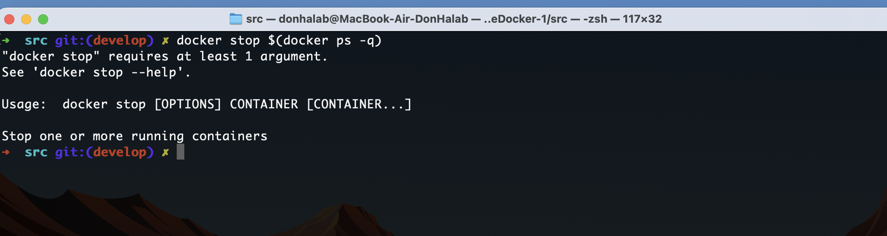

## SIMPLE DOCKER

### Part 1

**== Задание ==**

##### Взять официальный докер образ с **nginx** и выкачать его при помощи `docker pull`

##### Проверить наличие докер образа через `docker images`

##### Запустить докер образ через `docker run -d [image_id|repository]`
и проверить, что образ запустился через `docker ps`

##### Посмотреть информацию о контейнере через `docker inspect [container_id|container_name]`и по выводу команды определить и поместить в отчёт размер контейнера, список замапленных портов и ip контейнера

##### Остановить докер образ через `docker stop [container_id|container_name]`и проверить, что образ остановился через `docker ps`

##### Запустить докер с портами 80 и 443 в контейнере, замапленными на такие же порты на локальной машине, через команду *run*
##### Проверить, что в браузере по адресу *localhost:80* доступна стартовая страница **nginx**

##### Перезапустить докер контейнер через `docker restart [container_id|container_name]`и проверить любым способом, что контейнер запустился

## Part 2. Операции с контейнером

**== Задание ==**

##### Прочитать конфигурационный файл *nginx.conf* внутри докер контейнера через команду *exec*

##### Создать на локальной машине файл *nginx.conf* и настроить в нем по пути */status* отдачу страницы статуса сервера **nginx**

##### Скопировать созданный файл *nginx.conf* внутрь докер образа через команду `docker cp` и перезапустить **nginx** внутри докер образа через команду *exec*

##### Проверить, что по адресу *localhost:80/status* отдается страничка со статусом сервера **nginx**

##### Экспортировать контейнер в файл *container.tar* через команду *export*

##### Остановить контейнер

##### Удалить образ через `docker rmi [image_id|repository]`, не удаляя перед этим контейнеры

##### Удалить остановленный контейнер

##### Импортировать контейнер обратно через команду *import* и запустить импортированный контейнер

- При использовании команды docker import для создания образа из TAR-файла, все метаданные образа, включая команду запуска, теряются.
- В этой команде **nginx -g 'daemon off;'** - это команда, которая будет выполняться при запуске контейнера. Она запускает nginx в режиме "daemon off" в противном случаее контейнер будет сразу считать, что завершил работу при запуске.

##### Проверить, что по адресу *localhost:80/status* отдается страничка со статусом сервера **nginx**

## Part 3. Мини веб-сервер

**== Задание ==**

##### Написать мини сервер на **C** и **FastCgi**, который будет возвращать простейшую страничку с надписью `Hello World!`

##### Написать свой *nginx.conf*, который будет проксировать все запросы с 81 порта на *127.0.0.1:8080*

- Адрес 127.0.0.1 - это так называемый "loopback" или "localhost" адрес. Это специальный IP-адрес, который всегда указывает на саму машину, на которой выполняется код. Когда мы в конфигурации сервера Nginx указываем fastcgi_pass 127.0.0.1:8080;, мы говорим Nginx перенаправлять запросы на FastCGI-сервер, который работает на той же машине, что и Nginx, на порту 8080. 

##### Для запуска сервера необходимо:

1 - Снова скачать образ через **docker pull nginx**
2 - Запустить контейнер

3 - Cкопировать файлы внутрь контейнера

4 - Подключение к контейнеру командой **docker exec -it angry_gates bash**

5 - Обновление системы внутри контейнера

6 - Установка необходимых для работы компонентов и библиотек

7 - Компиляция и запуск сервера и его перезагрузка для вступления в силу изменений

##### Проверить, что в браузере по *localhost:81* отдается написанная вами страничка

## Part 4. Свой докер

1 - Создаем **Dockerfile**

2 - Прописываем скрипт который будет запущен сразу после запуска образа

##### Собрать написанный докер образ через `docker build` при этом указав имя и тег

##### Проверить через `docker images`, что все собралось корректно

##### Запустить собранный докер образ с маппингом 81 порта на 80 на локальной машине и маппингом папки *./nginx* внутрь контейнера по адресу, где лежат конфигурационные файлы **nginx**'а (см. [Часть 2](#part-2-операции-с-контейнером))

Используем команду: **docker run -d -p 80:81 -v $(pwd)/nginx/nginx.conf:/etc/nginx/nginx.conf miniserver:latets**

- Флаг -v в команде docker run используется для создания тома Docker и монтирования его в контейнер. Это позволяет сохранять данные вне жизненного цикла контейнера и делиться файлами между хостом и контейнером.

- Опция -p 80:81 говорит докеру пробросить порт 81 из контейнера на порт 80 вашей хост-машины. 

##### Проверить, что по localhost:80 доступна страничка написанного мини сервера

##### Дописать в *./nginx/nginx.conf* проксирование странички */status*, по которой надо отдавать статус сервера **nginx**

##### Перезапустить докер образ и проверить, что теперь по *localhost:80/status* отдается страничка со статусом **nginx**

## Part 5. **Dockle**

**== Задание ==**

##### Просканировать образ из предыдущего задания через `dockle [image_id|repository]

1 - Перва ошибка связана с самим образом Nginx, чтобы ее убрать нужно запускать dockle с ключачи **dockle -ak NGINX_GPGKEY_PATH -ak NGINX_GPGKEY miniserver:latets** Это позволяет игнорировать некоторые переменные окружения в данном случаее : NGINX_GPGKEY_PATH и NGINX_GPGKEY в которых и была ошибка. Это не устраняет проблему, а просто подавляет ошбику. 

2 - Вторая ошибка связанна с тем что кеш не был отчишен после update, для этого нужно добавить в dockerfile **rm -rf /var/lib/apt/lists/***

3 - Ошибка говорит о том что нельзя использовать root пользователя. Для ее исправления пришлось изменить dockerfile 

Также нужно было было заменить в файле nginx.conf место хранения временных файлов на **pid /tmp/nginx.pid;** Причина в том, что в Docker контейнере, директория "/var/run" является символической ссылкой на "/run", которая в свою очередь является tmpfs (временной файловой системой в памяти), и поэтому любые изменения владельца или группы, которые вы делаете в Dockerfile, не сохраняются.

4 - Для исправления 4 ошибки нужно включить **export DOCKER_CONTENT_TRUST=1**

5 - для исправления нужно добавить в dockerfile: **HEALTHCHECK CMD curl --fail http://localhost:80/status || exit 1** 

##### Исправить образ так, чтобы при проверке через **dockle** не было ошибок и предупреждений

## Part 6. Базовый **Docker Compose**

**== Задание ==**

##### Написать файл *docker-compose.yml*, с помощью которого:
##### 1) Поднять докер контейнер из [Части 5](#part-5-инструмент-dockle) _(он должен работать в локальной сети, т.е. не нужно использовать инструкцию **EXPOSE** и мапить порты на локальную машину)_
##### 2) Поднять докер контейнер с **nginx**, который будет проксировать все запросы с 8080 порта на 81 порт первого контейнера
##### Замапить 8080 порт второго контейнера на 80 порт локальной машины

Для того чтобы выполнить эти пункты необходимо создать файл **docker-compose.yml** и добавить туда следующию информацию:

- Указываем версию докер компоста,  на текущий момент последняя версия 3.8 (по состоянию на 26.07.23)
- Указываем сервисы(образы) которые будут запущены в данном случае мы будем создавать 2 контейнера с именами server и nginx-proxy.
- В поле **networks** контейнера server, указываем название сети которая будет созадана как локальная внутри контейнера. Важно заметить, что в описании контейнера server нет директивы ports, которая бы пробросила порты из контейнера на хост-машину. Это означает, что контейнер server недоступен с хост-машины напрямую, и доступ к нему возможен только через другие контейнеры в той же сети (в данном случае, через контейнер nginx-proxy).
- Поле **volumes**  используется для связывания файла nginx-proxy.conf на хост-машине с файлом /etc/nginx/conf.d/default.conf в контейнере. Это означает, что контейнер nginx-proxy будет использовать файл конфигурации, который вы предоставили на хост-машине.
Используем этот файл для конфигуации:

- **proxy_pass http://server:81;**  Эта директива указывает Nginx перенаправлять все входящие запросы на адрес http://server:81. Порт 81 — это порт, на котором приложение из 5 части слушает входящие соединения.

- Поле **ports** Это список портов, которые будут проброшены из контейнера на хост. "80:8080": Это указывает, что порт 8080 в контейнере должен быть проброшен на порт 80 на хосте.

- Поле **depends_on** Это список сервисов, от которых зависит этот сервис. докер компост гарантирует, что эти сервисы будут запущены перед запуском данного сервиса. 

- Поле **networks** Это список сетей, к которым будет подключен данный сервис.

- Поле **bridge** - это драйвер сети по умолчанию в докер. Когда создается новый контейнер, если не указать сетевой драйвер, он автоматически присоединяется к сети с драйвером bridge.

##### Остановить все запущенные контейнеры

Тут указнно что у меня нет запущенных контенером поэтому не получается получить из них идентификаторы флагом -q

##### Собрать и запустить проект с помощью команд `docker-compose build` и `docker-compose up`

##### Проверить, что в браузере по *localhost:80* отдается написанная вами страничка, как и ранее

